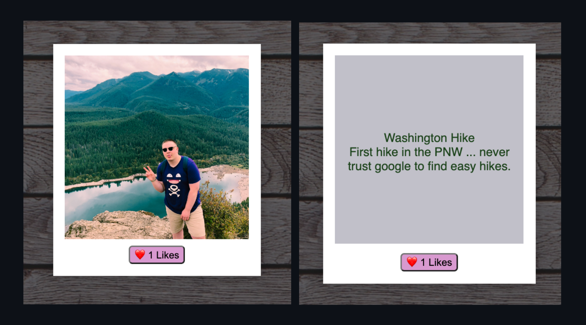
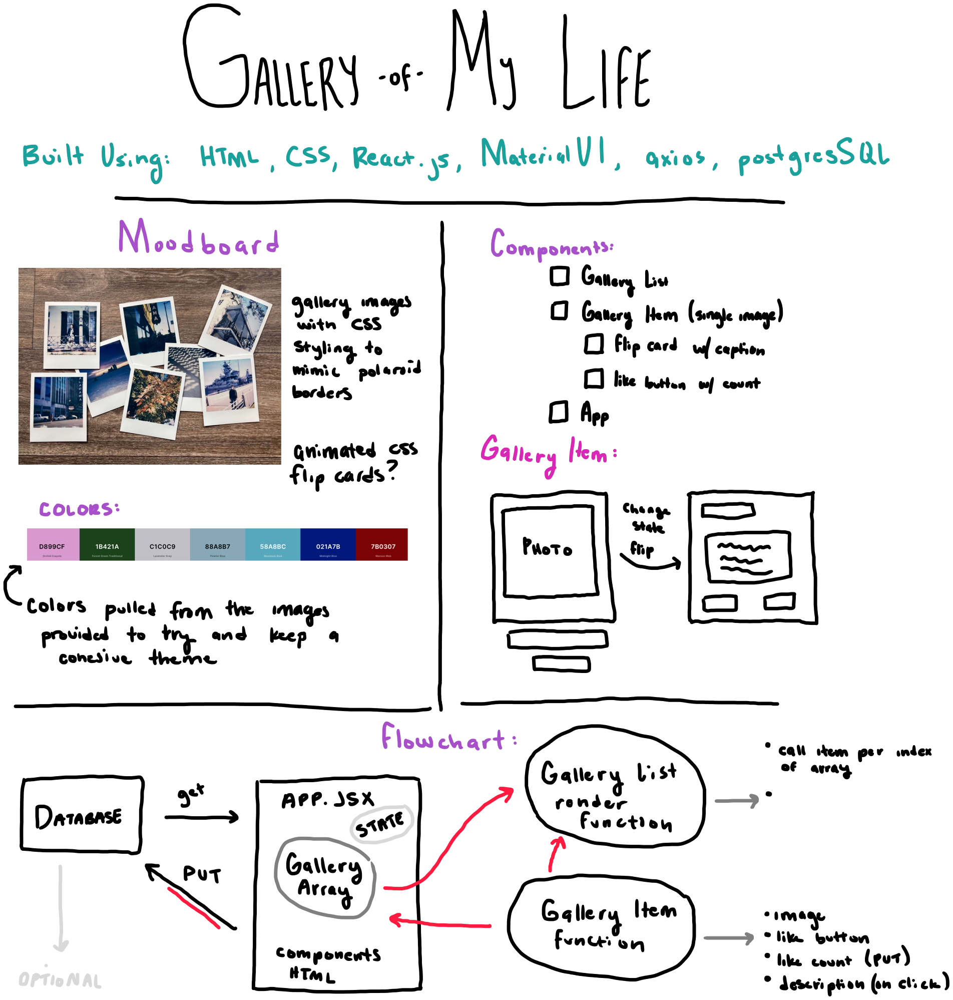
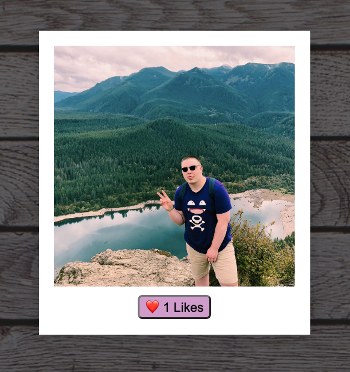
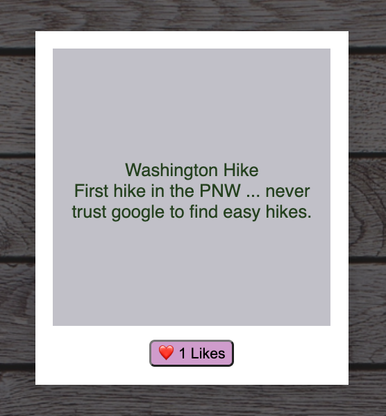

# React Photo Gallery:

## Description

_Duration: 16 hour Sprint_

As a weekend assignment - we were tasked with using our newfound knowledge of React.js to create an interactive image gallery site.

## Screen Shots

Gallery List View followed by Item View:

## Description & Approach

As I continue to develop my personal workflow - I am trying to get into the habit of breaking down the complexity of the project at hand. One way I do this is by making a visual To-Do list / Flow Chart for me to follow. (like the one below). 
In this particular assignment - I found this useful to try and break down the task at hand into manageable React Components.

### Prerequisites
- [Node.js](https://nodejs.org/en/)
- React.js
- Express 
- Body-Parser
- 'PG'
- Database Manager

## Installation
1. Clone this repository for your own access.
2. Open up your editor of choice and run an `npm install`
3. Open two Terminal Tabs
4. Run `npm run server`  and `npm run client`in your terminal
5. Navigate to http://localhost:3000/

## Usage
This web application is meant to display meaningful moments / images for others to view:
 1. Hover over a photo that piques your interest to view it in color
 2. Click on the photo to view the Title and brief description.
 3. If you enjoyed the content - interact by pressing the `like` button!
 4. Want to see the photo again? Click on the description to flip the card back over.

## Developer Notes

Given the opportunity to revisit this project - I would love to approach styling it using a React compatible css library ... Given the current theming of the application I didn't find a library that seemed applicable. 

I would also like to move the data stored on each `Picture` into a database to maintain a more accurate count for likes - as well as simplify the storage if the number of items were to grow.

Finally, I would like to add a field where users could customize the gallery to their own preferences ... uploading their own images and descriptions.

## Acknowledgement
Thanks to [Prime Digital Academy](www.primeacademy.io) who equipped and helped me to make this application a reality.

# React Photo Gallery:

## Description

_Duration: 16 hour Sprint_

As a weekend assignment - we were tasked with using our newfound knowledge of React.js to create an interactive image gallery site.

## Screen Shots

Gallery List View:

Gallery Item View:

## Description & Approach

As I continue to develop my personal workflow - I am trying to get into the habit of breaking down the complexity of the project at hand. One way I do this is by making a visual To-Do list / Flow Chart for me to follow. (like the one below). 
In this particular assignment - I found this useful to try and break down the task at hand into manageable React Components.

### Prerequisites
- [Node.js](https://nodejs.org/en/)
- React.js
- Express 
- Body-Parser
- 'PG'
- Database Manager

## Installation
1. Clone this repository for your own access.
2. Open up your editor of choice and run an `npm install`
3. Open two Terminal Tabs
4. Run `npm run server`  and `npm run client`in your terminal
5. Navigate to http://localhost:3000/

## Usage
This web application is meant to display meaningful moments / images for others to view:
 1. Hover over a photo that piques your interest to view it in color
 2. Click on the photo to view the Title and brief description.
 3. If you enjoyed the content - interact by pressing the `like` button!
 4. Want to see the photo again? Click on the description to flip the card back over.

## Developer Notes

Given the opportunity to revisit this project - I would love to approach styling it using a React compatible css library ... Given the current theming of the application I didn't find a library that seemed applicable. 

I would also like to move the data stored on each `Picture` into a database to maintain a more accurate count for likes - as well as simplify the storage if the number of items were to grow.

Finally, I would like to add a field where users could customize the gallery to their own preferences ... uploading their own images and descriptions.

## Acknowledgement
Thanks to [Prime Digital Academy](www.primeacademy.io) who equipped and helped me to make this application a reality.
